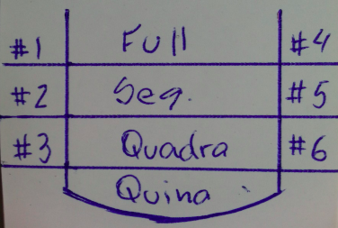

# Bozó
Bozó é um jogo de dados cujo cada jogador tem que tentar preencher 10 posições de um tabuleiro, como o mostrado abaixo.

## Regras do jogo
Em cada rodada, o jogador lança os 5 dados. Depois pode escolher ficar com a pontuação que tirou ou escolher entre 1 e 5 dados para lançar novamente. Em seguida pode, se quiser, escolher mais uma vez alguns dos dados para lançar de novo. Ao final, deve escolher qual a posição do tabuleiro irá preencher. Uma posição já preenchida em rodada anterior, não pode ser utilizada de novo. A pontuação obtida depende da posição escolhida e da configuração final dos dados. 

Nas posições externas devem ser colocadas as somas dos dados que apreesentam os números correspondentes à posição escolhida. Por exeplo, se o jogado seleciona a posição “# 3” e nos dados consguiu tirar 4 dados com a pontuação 3, então o valor a ser colocado é 12.

Nas posições internas, o jogador recebe uma pontuação fixa, se conseguir determina configuração dos dados e zero se os dados não apresentarem tal configuração. A primeira posição é um “full hand” ou seja, três dados de determinado número e dois de outro (ou do mesmo) e vale 15 pontos. A segunda é uma sequência, ou seja, os dados têm todos os números de 1 a 5 ou de 2 a 6, valendo 20 pontos. A terceira é a posição da quadra (30 pontos) e a última da quina, que vale 40 pontos.

## Classes importantes da implementação
- ClasseDado: ao criar o objeto é possível estabelecer o número de lados. A rolagem do dado é feita por meio de um gerador de números aleatórios (Random). Métodos: getLado(), rolar(), toString().

- ClasseRolaDados: classe auxiliar que permite gerencia um conjunto de vários dados simultaneamente. Operações como rolar alguns dos dados ou exibir o resultado de todos eles, são implementadas. Métodos: rolar(…), toString(),

- ClassePlacar: representa o placar de um jogo de Bozó. Permite que combinações de dados sejam alocadas às posições e
mantém o escore de um jogador. Métodos: add(…), getScore(), toString().

- ClasseBozo: classe inicial do programa Bozó. Possui apenas o método main, que cuida da execução do jogo.